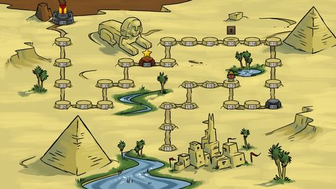
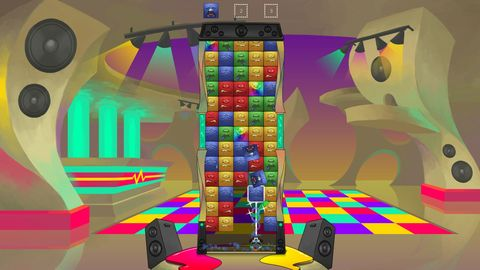
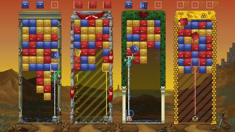

    

        <iframe src="https://www.youtube.com/embed/-vPjY10w1CU" frameborder="0" allowfullscreen></iframe>
    

 

Race your friends in multiplayer or challenge yourself in story mode. 
Solve progressively more difficult and creative puzzles, help a sausage make friends, 
and find out what happened to the Tumblecrown.

<a class="button center" href="store.steampowered.com/app/269710/">Buy Tumblestone on Steam</a>

<ol class="screenshots">
    <li></li>
    <li></li>
    <li></li>
    <li></li>
</ol>

<ul class="quotes">
   <li>
       <blockquote cite="http://www.destructoid.com/tumblestone-is-the-most-intelligent-match-three-game-i-ve-ever-played-288776.phtml">
           "Tumblestone is the most intelligent Match-3 game I've ever played."
           <footer><a href="http://www.destructoid.com/tumblestone-is-the-most-intelligent-match-three-game-i-ve-ever-played-288776.phtml">-Destructoid</a></footer>
       </blockquote>
   </li>
   <li>
       <blockquote cite="http://arstechnica.com/gaming/2015/05/the-new-wave-20-indie-games-to-keep-an-eye-on/3/">
           "We haven't been bit this hard by the 'oh, just one more game' bug in a long time."
           <footer><a href="http://arstechnica.com/gaming/2015/05/the-new-wave-20-indie-games-to-keep-an-eye-on/3/">-Ars Technica</a></footer>
       </blockquote>
   </li>
   <li>
       <blockquote cite="http://www.escapistmagazine.com/articles/view/video-games/editorials/reviews/17146-Tumblestone-Review-Indie-Match-3-Puzzle-Multiplayer">
           "You definitely need to play it. It is a rare breed of game that offers exactly what it promises, and does so flawlessly."
           <footer><a href="http://www.escapistmagazine.com/articles/view/video-games/editorials/reviews/17146-Tumblestone-Review-Indie-Match-3-Puzzle-Multiplayer">-The Escapist</a></footer>
       </blockquote>
   </li>
</ul>

[Check out the official Tumblestone web page.](http://tumblestonegame.com)

[Want to write about Tumblestone? Download the Press Kit.](http://tumblestonegame.com/press/index.html)